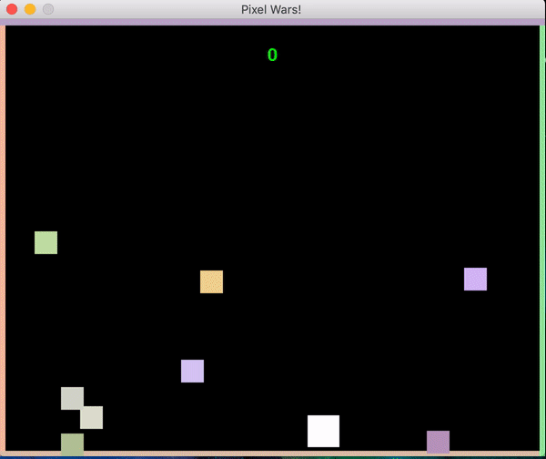

# Pixwar



It's an arcade style fixed base shooting game made in Pygame with ❤️

## How to run?

Because of issues unknown, Pygame refuses to listen to events like keyboard input when run from the terminal.
The only way it works is if you run this from IDLE(The official Python IDE).

```
git clone https://github.com/manan2002/PixWar.git
pip install pygame
```
Open the file in IDLE and hit F5 to run the program.
